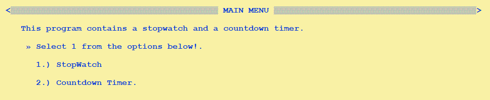
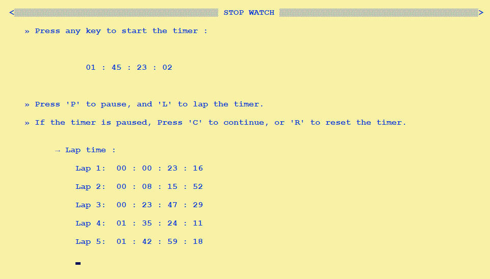
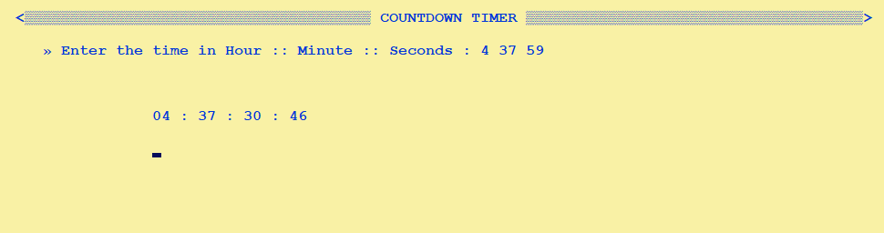

## Overview
This C project consists of a stopwatch and a countdown timer. 

It was built using the [CLION IDE](https://www.jetbrains.com/clion/download/) and it has four files: **[main.c](main.c)**, **[stopwatch.c](stopwatch.c)**, **[countdown.c](countdown.c)**, and **[essentials.h](essentials.h)**.
* The **[main.c](main.c)** program file that handles user input and calls the appropriate functions.
* The **[essentials.h](essentials.h)** file contains the declarations for the functions used in the project.
* The **[stopwatch.c](stopwatch.c)** file contains the function that runs the stopwatch.
* The **[countdown.c](countdown.c)** file contains the function that runs the countdown timer.
> 
> > 
> > 
## Features
* **The countdown timer has one feature:**
  1. [X] It counts down from a specified number of hours, minutes, and seconds.

* **The stopwatch has the following features:**

  1. [X] **Lap:** This feature allows the user to record the current time of the stopwatch and display it on the screen.
  2. [X] **Pause:** The pause feature allows the user to pause the stopwatch at any time.
  3. [X] **Reset:** This feature allows the user to reset the stopwatch to 0.

## Building and Running the Project

> To build and run the project, follow these steps:
> * Open the project in the CLION or any IDE.
> * Build the project by clicking the "Build" button in the toolbar or by pressing Ctrl + F9.
> * Run the project by clicking the "Run" button in the toolbar or by pressing Shift + F10.

>### Author : [Mr Mas](https://www.linkedin.com/in/mrmasio/)
>### Project date : on 01/01/2023

* **I hope this is helpful overview of the C project. If you have any questions or issues running the code, please don't hesitate to [ask](https://instagram.com/mrmas.io/)**.